<meta charset="utf-8">

# PICO CTF - Log

### net cat - Points: 75 - (Solves: 23365)

**Problem:** Using netcat (nc) will be a necessity throughout your adventure. Can you connect to 2018shell.picoctf.com at port 49387 to get the flag?

**Wskazówka:** nc tutorial

**Rozwiązanie:**

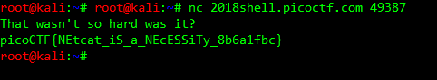 

### HEEEEEEERE'S Johnny! - Points: 100 - (Solves: 9811)

**Problem:** Okay, so we found some important looking files on a linux computer. Maybe they can be used to get a password to the process. Connect with nc 2018shell.picoctf.com 35225. Files can be found here: [passwd](https://2018shell.picoctf.com/static/a488bb3c175bc843e0fbce95fff920d9/passwd) [shadow](https://2018shell.picoctf.com/static/a488bb3c175bc843e0fbce95fff920d9/shadow).

**Wskazówka:** If at first you don't succeed, try, try again. And again. And again.
If you're not careful these kind of problems can really "rockyou".

**Rozwiązanie:**

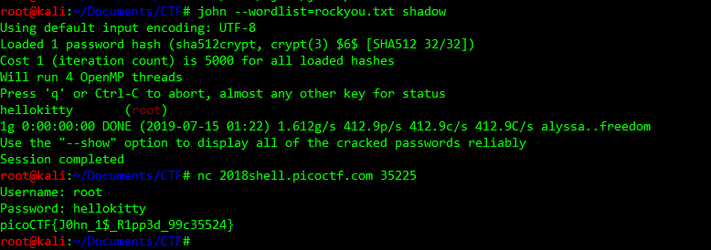 

### pipe - Points: 110 - (Solves: 15917)

**Problem:** During your adventure, you will likely encounter a situation where you need to process data that you receive over the network rather than through a file. Can you find a way to save the output from this program and search for the flag? Connect with 2018shell.picoctf.com 48696.

**Wskazówka:** Remember the flag format is picoCTF{XXXX}
Ever heard of a pipe? No not that kind of pipe... [This](http://www.linfo.org/pipes.html) kind

**Rozwiązanie:**

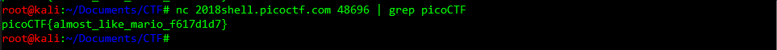 

### Aca-Shell-A - Points: 150 - (Solves: 12524)

**Problem:** It's never a bad idea to brush up on those linux skills or even learn some new ones before you set off on this adventure! Connect with nc 2018shell.picoctf.com 27833.

**Wskazówka:** Linux for [Beginners](https://maker.pro/education/basic-linux-commands-for-beginners)

**Rozwiązanie:**

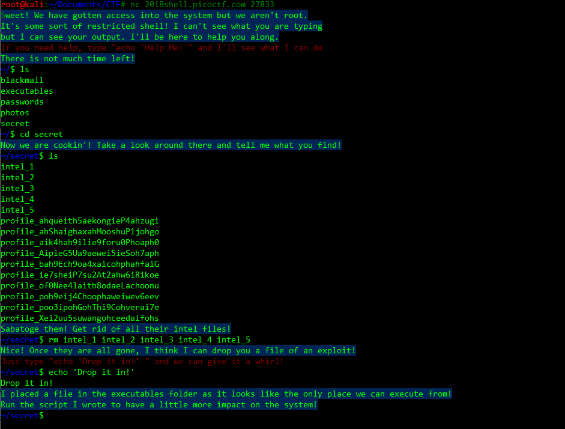 
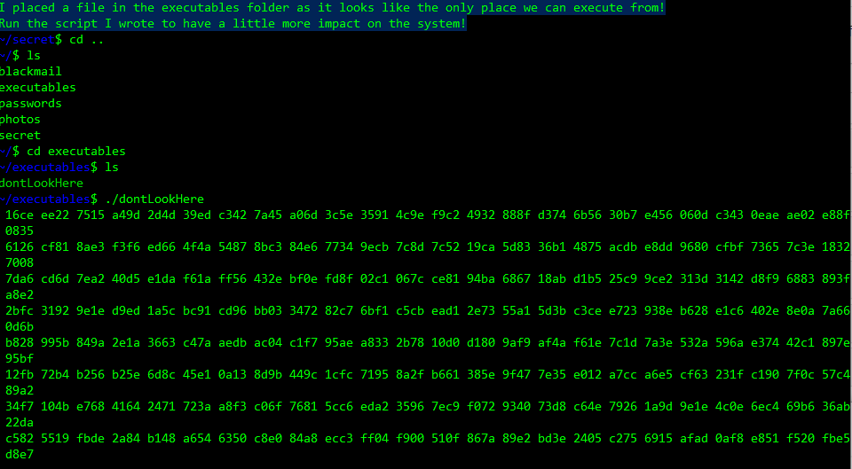 
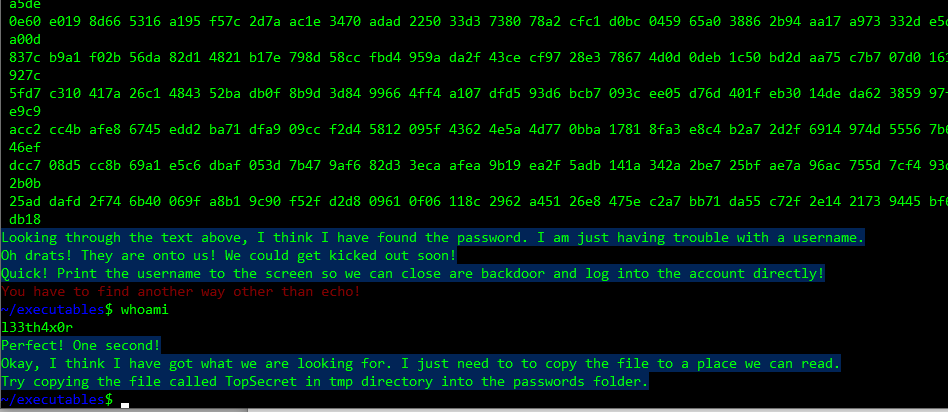 
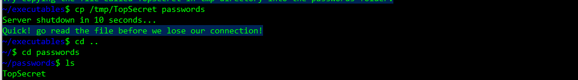 
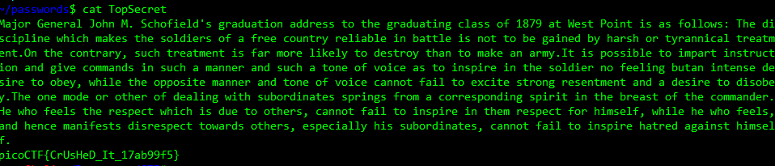 

### Client Side is Still Bad - Points: 150 - (Solves: 17796)

**Problem:** I forgot my password again, but this time there doesn't seem to be a reset, can you help me? http://2018shell.picoctf.com:5399

**Wskazówka:** Client Side really is a bad way to do it.

**Rozwiązanie:** Źródło strony

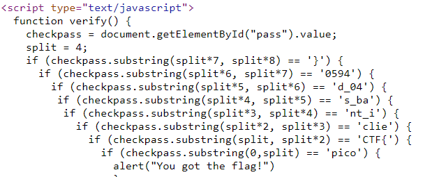 

### Logon - Points: 150 - (Solves: 11413)

**Problem:** I made a website so now you can log on to! I don't seem to have the admin password. See if you can't get to the flag. http://2018shell.picoctf.com:5477

**Wskazówka:** Hmm it doesn't seem to check anyone's password, except for admins?
How does check the admin's password?

**Rozwiązanie:** Ingerencja w cookisy [python](/logon/run.py)

### script me - Points: 500 - (Solves: 1007)

**Problem:** Can you understand the language and answer the questions to retrieve the flag? Connect to the service with nc 2018shell.picoctf.com 8672

**Wskazówka:** Maybe try writing a python script?

**Rozwiązanie:** Screen przedstawia ręczne rozwiązanie. Mam dodatkowo skrypt, jednak kod nie działa pomimo tego, że jest prawidłowy.
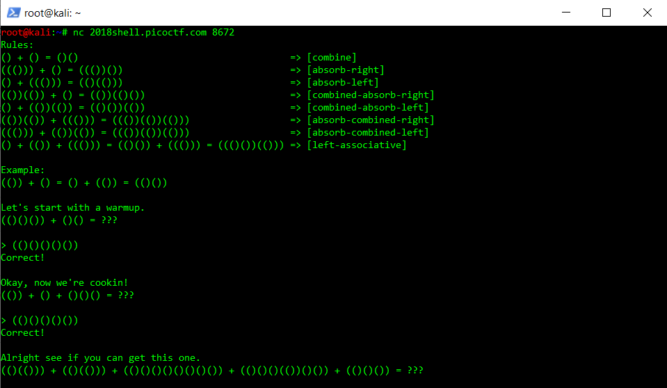

### Inspect Me - Points: 125 - (Solves: 20448)

**Problem:** Inpect this code! http://2018shell.picoctf.com:56252

**Wskazówka:** How do you inspect a website's code on a browser?
Check all the website code.

**Rozwiązanie:**

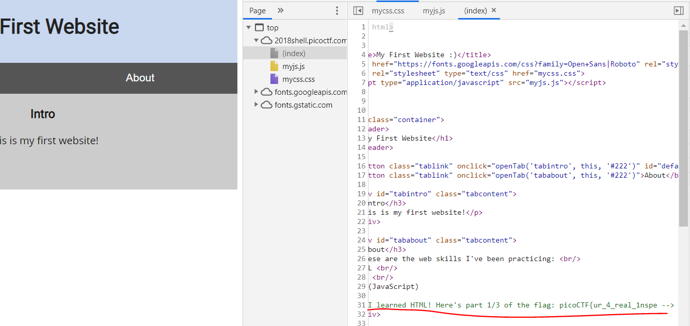
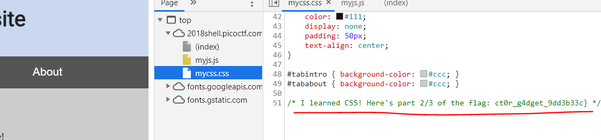 